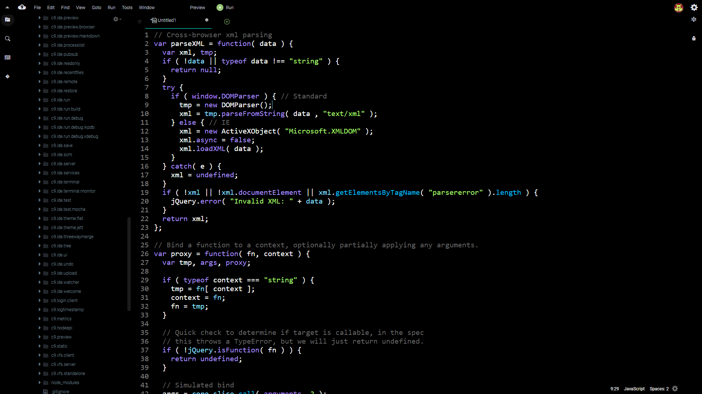
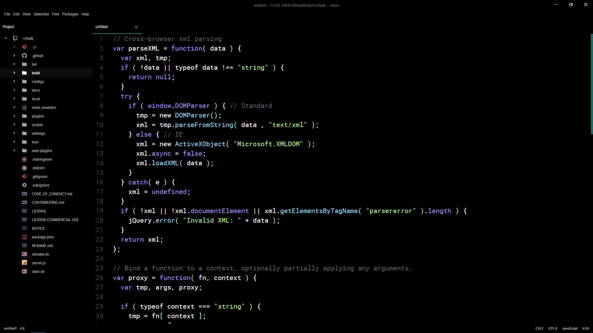

# cloud9_extra_dark
This a theme for Cloud9 based upon the Atom Material theme and the FramerJs Syntax theme.

Full disclosure, this was built off of [c9.ide.theme.jett](https://github.com/jumbojett/c9.ide.theme.jett).
Due to my lack of knowledge of the cloud9 plugin structure; the names and installation instructions are coherent. This will change in the future.

# Cloud9



# Atom



1. git clone

2. Unzip the 'c9.ide.theme.jett.zip' and move the c9.ide.theme.jett to `9sdk/plugins/c9.ide.theme.jett`.

3. Open `c9sdk/configs/client-default.js`. Before `return plugins;` add the following:
  
  ```
  {
     packagePath: "plugins/c9.ide.theme.jett/plugin",
     staticPrefix: staticPrefix + "/plugins/c9.ide.theme.jett"
  }
  ```

3. Open `c9sdk/configs/standalone.js`. Add the following somewhere in the config:

    ```js
    {
       packagePath: "./c9.ide.theme.jett/build-theme",
       pathRoot: __dirname
    }
    ```

4. Run `c9sdk/scripts/makestandalone.sh`

5. Start with `node server.js -p 8081 -a : --collab`
